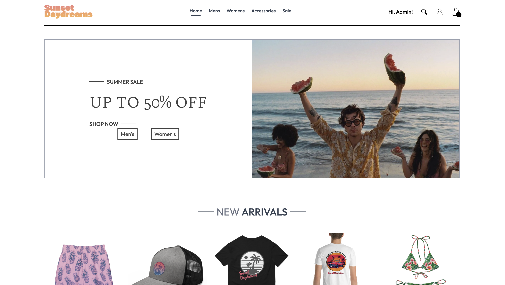
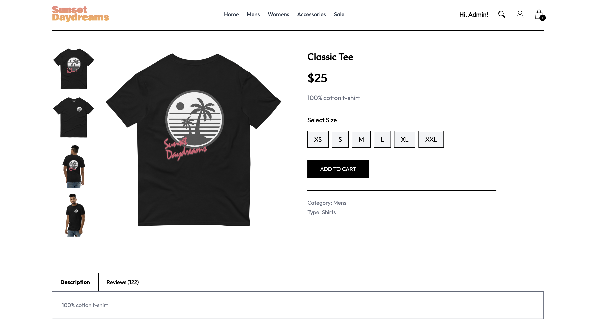
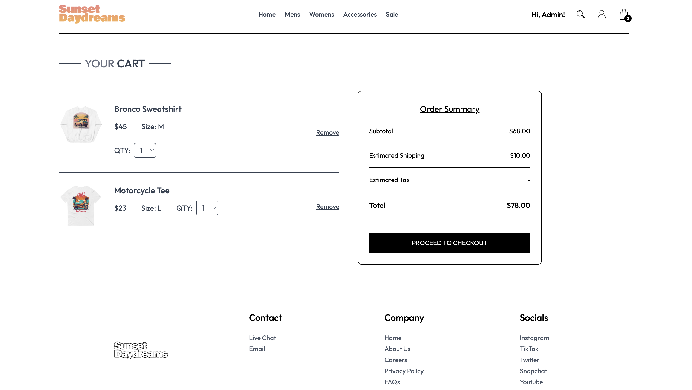
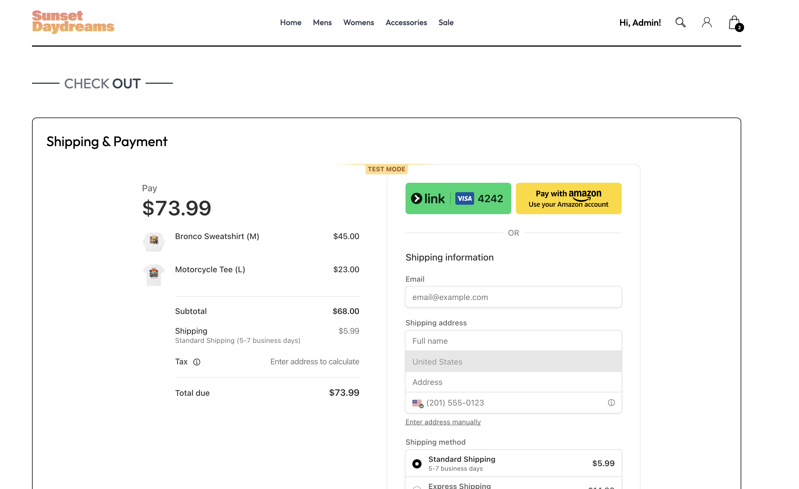
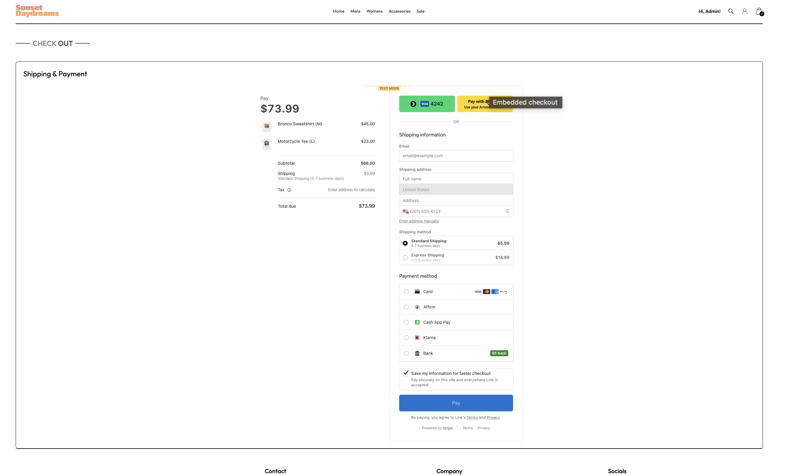
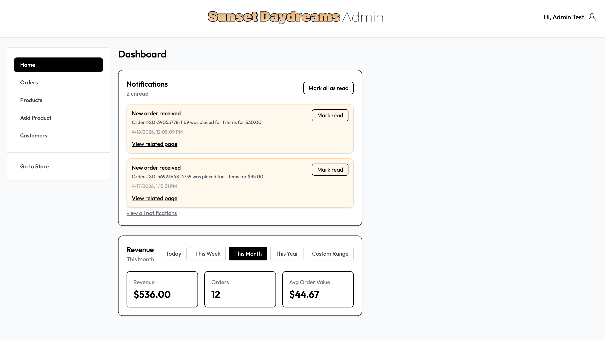
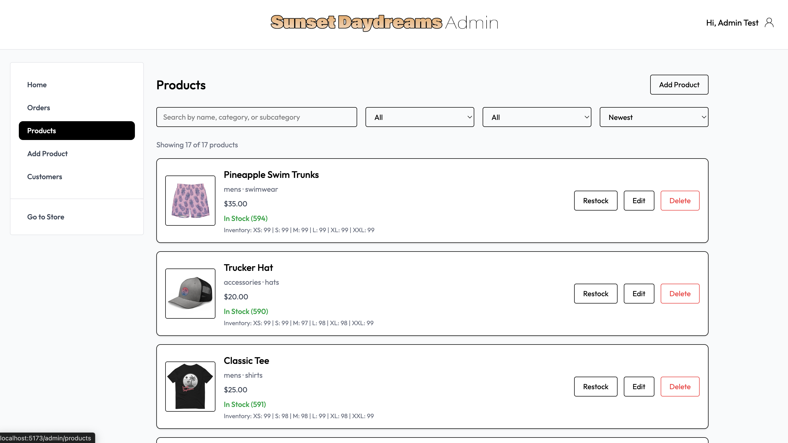
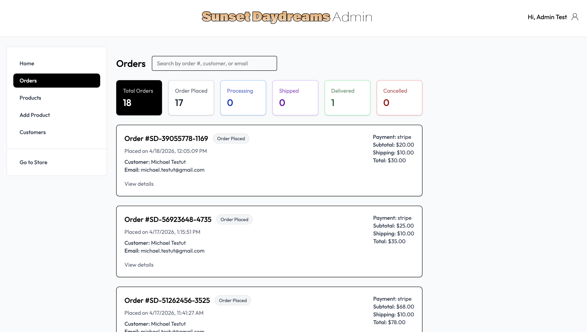
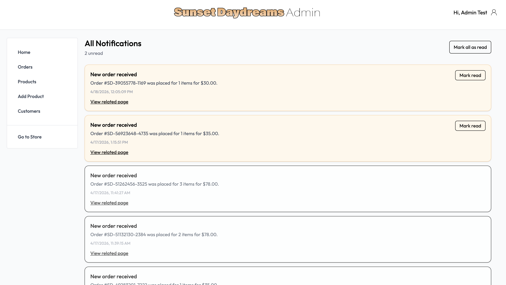

# Sunset Daydreams

Sunset Daydreams is a full-stack e-commerce web application built for a coastal lifestyle clothing brand. It includes a customer storefront, secure authentication, Stripe checkout, order management, inventory tracking, and an admin dashboard for managing products and store activity.

## Live Demo
- Frontend: [Add deployed frontend URL]
- Backend API: [Add deployed backend URL]

## Demo Accounts
- Admin - test admin email: admin@test.com / test password: password
- Customer - test customer email: user@test.com  / test password: password

## Why I Built This

I built Sunset Daydreams to create a realistic full-stack e-commerce application that demonstrates production-style architecture, payment processing, protected admin tooling, and a polished user experience beyond a basic CRUD app.

## Features

### Customer Features
- Browse products by category
- Search and filter products
- View product details and available sizes
- Add items to cart
- Embedded Stripe checkout
- View order confirmation and order history
- Register, log in, and manage account access

### Admin Features
- Add, edit, and delete products
- Manage categories and subcategories
- Update inventory by size
- View and manage customer orders
- Update order status
- Receive notifications for:
    - new orders
    - low stock items
    - out of stock items

## Tech Stack

### Frontend
- React
- Redux Toolkit
- React Router
- Tailwind CSS
- Stripe React SDK
- Vite

### Backend
- Node.js
- Express
- MongoDB
- Mongoose
- JWT Authentication
- Cloudinary
- Stripe API

## Architecture Highlights
- Role-based access control for admin and customer routes
- JWT-based authentication with client-side expiration handling
- Inventory-aware checkout flow
- Notification system for store operations
- Persistent cart and auth state using local storage

## Screenshots
Home Page

Product page

Cart

Checkout

Admin dashboard

Admin products page

Admin orders page

Notifications page

